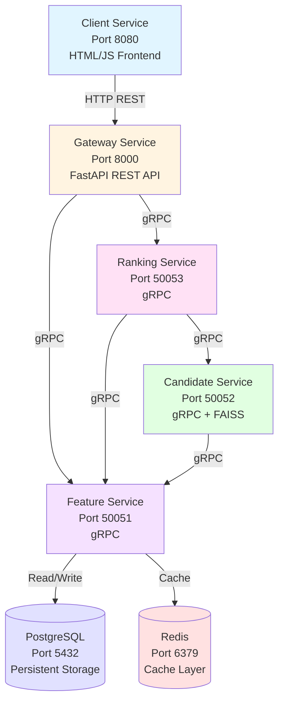
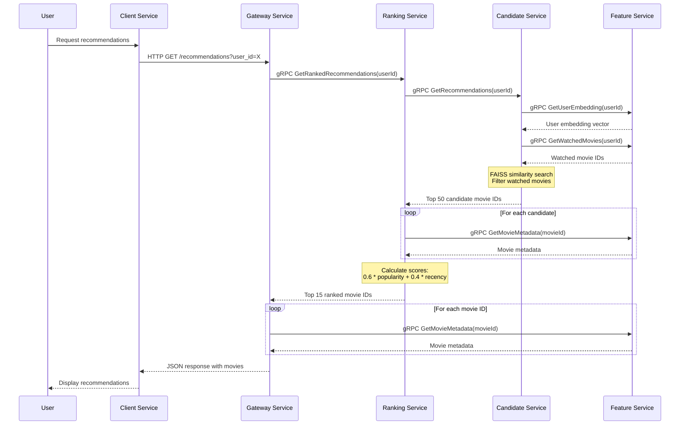
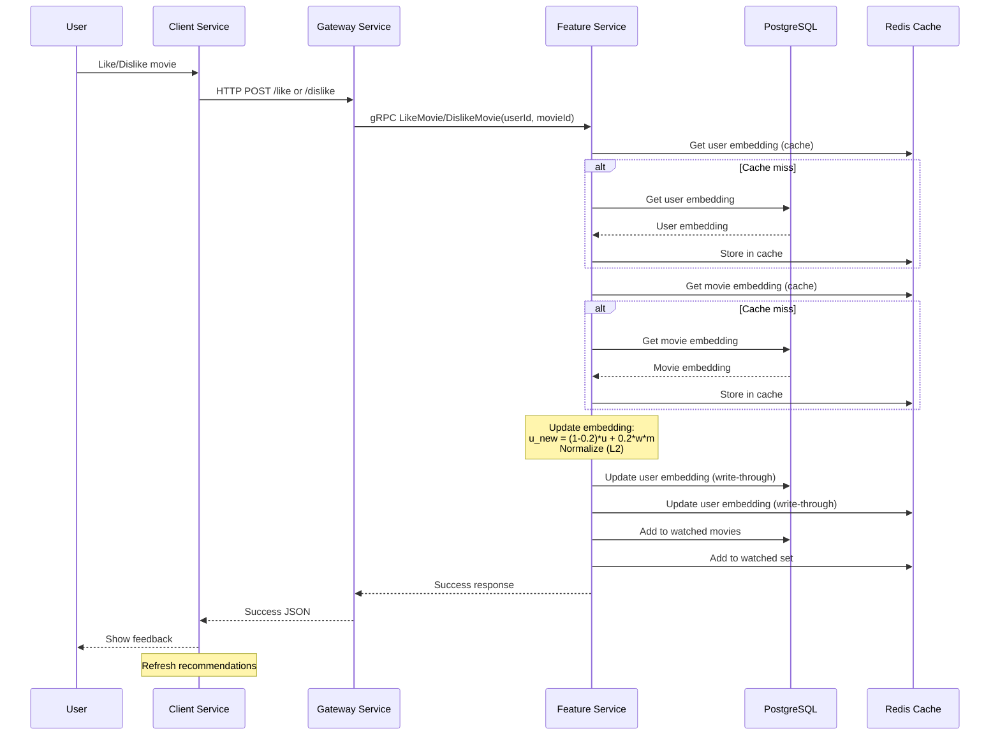

# 🎬 Movie Recommender System


A high-performance, microservices-based movie recommendation system built with gRPC, FastAPI, and modern ML techniques. The system provides personalized movie recommendations using collaborative filtering with embeddings, featuring a two-stage recommendation pipeline (candidate generation + ranking) for optimal performance and relevance.


## 🎯 Overview

This movie recommendation system is designed as a production-ready microservices architecture that scales horizontally. It uses:

- **Embedding-based Collaborative Filtering**: 64-dimensional embeddings for users and movies
- **Two-Stage Recommendation Pipeline**: Fast candidate generation followed by intelligent ranking
- **Real-time Learning**: User preferences update embeddings dynamically as they interact
- **High Performance**: Redis caching, FAISS similarity search (GPU-accelerated when available), and optimized database queries

The system processes the MovieLens 25M dataset, serving recommendations to users through a clean web interface while maintaining sub-second latency.


## 🏗️ Architecture

The system follows a microservices architecture with clear separation of concerns:



### Service Communication

- **Client ↔ Gateway**: HTTP REST API
- **Gateway ↔ Services**: gRPC (Protocol Buffers)
- **Services ↔ Data**: PostgreSQL (persistent storage) + Redis (caching layer)


## 🔧 Services

### 1. **Client Service** (Port 8080)
- **Technology**: Vanilla JavaScript, HTML, CSS
- **Purpose**: User-facing web interface
- **Features**:
  - Browse personalized movie recommendations
  - View movie details (title, year, genres, ratings)
  - Like/dislike movies to improve recommendations
  - Clean, responsive UI

### 2. **Gateway Service** (Port 8000)
- **Technology**: FastAPI (Python)
- **Purpose**: API gateway and protocol translation
- **Responsibilities**:
  - Exposes REST endpoints for the frontend
  - Translates HTTP requests to gRPC calls
  - Aggregates responses from multiple services
  - Handles CORS and error handling
- **Endpoints**:
  - `GET /recommendations?user_id={id}` - Get ranked recommendations
  - `POST /like` - Like a movie
  - `POST /dislike` - Dislike a movie

### 3. **Feature Service** (Port 50051)
- **Technology**: gRPC (Python)
- **Purpose**: Central data service for embeddings and metadata
- **Responsibilities**:
  - Manages user and movie embeddings (64-dimensional vectors)
  - Stores and retrieves movie metadata (title, year, genres, ratings)
  - Tracks watched movies per user
  - Updates user embeddings based on likes/dislikes
  - Write-through caching strategy (PostgreSQL + Redis)
- **Key Operations**:
  - `GetUserEmbedding` - Retrieve user embedding vector
  - `GetMovieEmbedding` - Retrieve movie embedding vector
  - `GetMovieMetadata` - Get movie details
  - `LikeMovie` / `DislikeMovie` - Update user preferences
  - `GetWatchedMovies` - Filter out already-watched movies

### 4. **Candidate Service** (Port 50052)
- **Technology**: gRPC (Python), FAISS
- **Purpose**: Fast candidate generation using similarity search
- **Responsibilities**:
  - Loads all movie embeddings into memory on startup
  - Builds FAISS index for fast similarity search (GPU-accelerated if available)
  - Generates top 50 candidate movies based on user embedding similarity
  - Filters out movies the user has already watched
- **Algorithm**: Cosine similarity search using normalized embeddings

### 5. **Ranking Service** (Port 50053)
- **Technology**: gRPC (Python)
- **Purpose**: Intelligent ranking of candidates
- **Responsibilities**:
  - Receives 50 candidates from candidate service
  - Ranks them using a scoring function
  - Returns top 15 most relevant recommendations
- **Scoring Formula**:
  ```
  score = 0.6 * popularity_score + 0.4 * recency_score
  
  where:
  - popularity_score = log(1 + num_ratings)
  - recency_score = 1 / (1 + age_in_years)
  ```


## 🔄 Data Flow

### Recommendation Request Flow



### Like/Dislike Flow




## 🛠️ Technologies

### Backend
- **Python 3.x** - Core language
- **gRPC** - Inter-service communication
- **Protocol Buffers** - Service contracts
- **FastAPI** - REST API framework
- **PostgreSQL** - Persistent data storage
- **Redis** - High-performance caching layer
- **FAISS** (Facebook AI Similarity Search) - Vector similarity search
- **NumPy** - Numerical computations

### Frontend
- **Vanilla JavaScript** - No framework dependencies
- **HTML5/CSS3** - Modern web standards

### Infrastructure
- **Docker** - Containerization
- **Docker Compose** - Multi-container orchestration
- **uv** - Fast Python package manager


## 📦 Setup

### Prerequisites

- Docker and Docker Compose installed
- MovieLens 25M dataset downloaded

### Initial Setup

1. **Clone the repository**:
   ```bash
   git clone <repository-url>
   cd movie-recommender
   ```

2. **Prepare the dataset**:
   
   Download the [MovieLens 25M dataset](https://grouplens.org/datasets/movielens/25m/) and extract it. Move the following files into the `./data/` directory:
   ```
   data/
   ├── checksums.txt
   ├── links.csv
   ├── movies.csv
   ├── ratings.csv
   ├── README.txt
   └── tags.csv
   ```

3. **Generate embeddings** (if not already present):
   
   The system expects pre-computed embeddings. If you have `movie_embeddings.pkl` and `user_embeddings.pkl` files, place them in the `./data/` directory. Otherwise, you'll need to generate them using the `embedding-calc/` module.

4. **Generate movie rating counts** (optional but recommended):
   
   Run the script to generate `movie_num_ratings.csv`:
   ```bash
   python data/num_ratings_per_movie.py
   ```
   
   This creates a CSV file with rating counts per movie, which improves ranking quality.


## 🚀 Running the System

### Start All Services

From the project root, run:

```bash
docker-compose up --build
```

This will:
1. Build Docker images for all services
2. Start PostgreSQL and Redis
3. Start all microservices in dependency order
4. Initialize the database schema
5. Load embeddings and metadata into the database
6. Pre-warm Redis cache

### Access the Application

- **Web Interface**: http://localhost:8080
- **Gateway API**: http://localhost:8000
- **API Documentation**: http://localhost:8000/docs (FastAPI auto-generated docs)

### Service Health Checks

- Gateway: `curl http://localhost:8000/`
- Feature Service: Check Docker logs for "gRPC EmbeddingService serving"
- Candidate Service: Check Docker logs for "FAISS index built successfully"
- Ranking Service: Check Docker logs for "gRPC RankingService serving"

### Stopping the System

```bash
docker-compose down
```

To also remove volumes (clears database):
```bash
docker-compose down -v
```


## 📡 API Documentation

### Get Recommendations

**Endpoint**: `GET /recommendations`

**Query Parameters**:
- `user_id` (required): Integer user ID

**Response**:
```json
{
  "movies": [
    {
      "movieId": 123,
      "title": "The Matrix",
      "releaseYear": 1999,
      "genres": ["Action", "Sci-Fi"],
      "numRatings": 50000
    },
    ...
  ]
}
```

### Like a Movie

**Endpoint**: `POST /like`

**Request Body**:
```json
{
  "user_id": 0,
  "movie_id": 123
}
```

**Response**:
```json
{
  "success": true,
  "message": "Successfully liked movie 123"
}
```

### Dislike a Movie

**Endpoint**: `POST /dislike`

**Request Body**:
```json
{
  "user_id": 0,
  "movie_id": 123
}
```

**Response**:
```json
{
  "success": true,
  "message": "Successfully disliked movie 123"
}
```


## 🧠 Recommendation Algorithm

### Embedding Generation

The system uses pre-computed embeddings (64-dimensional vectors) for users and movies. These embeddings capture latent factors that represent user preferences and movie characteristics.

### Candidate Generation

1. **User Embedding Retrieval**: Get the user's current embedding vector
2. **Similarity Search**: Use FAISS to find movies with similar embeddings (cosine similarity)
3. **Filtering**: Remove movies the user has already watched
4. **Top-K Selection**: Return top 50 candidates

### Ranking

The ranking service scores each candidate using:

```
score = 0.6 * log(1 + num_ratings) + 0.4 * (1 / (1 + age_in_years))
```

This balances:
- **Popularity**: Movies with more ratings are generally more reliable
- **Recency**: Newer movies are often more relevant

The top 15 movies by score are returned to the user.

### User Preference Learning

When a user likes or dislikes a movie, their embedding is updated using exponential moving average:

```
u_new = (1 - 0.2) * u + 0.2 * w * m
```

Where:
- `u` = current user embedding
- `m` = movie embedding
- `w` = 1.0 for like, -0.5 for dislike
- The result is L2-normalized

This allows the system to learn user preferences in real-time.


## 🗄️ Database Schema

### PostgreSQL Tables

#### `user_embeddings`
- `user_id` (PRIMARY KEY): Integer
- `embedding` (BYTEA): Pickled NumPy array (64 floats)
- `updated_at` (TIMESTAMP): Last update time

#### `movie_embeddings`
- `movie_id` (PRIMARY KEY): Integer
- `embedding` (BYTEA): Pickled NumPy array (64 floats)
- `updated_at` (TIMESTAMP): Last update time

#### `user_watched_movies`
- `user_id` (INTEGER, part of PRIMARY KEY)
- `movie_id` (INTEGER, part of PRIMARY KEY)
- `created_at` (TIMESTAMP)
- Indexes on both `user_id` and `movie_id` for fast lookups

#### `movie_metadata`
- `movie_id` (PRIMARY KEY): Integer
- `title` (TEXT): Movie title
- `release_year` (INTEGER): Release year (nullable)
- `genres` (TEXT[]): Array of genre strings
- `num_ratings` (INTEGER): Number of ratings received
- `created_at` (TIMESTAMP)

### Redis Cache Structure

- **User Embeddings**: `user:{user_id}` → Pickled embedding
- **Movie Embeddings**: `movie:{movie_id}` → Pickled embedding
- **Movie Metadata**: `movie_metadata:{movie_id}` → Pickled metadata dict
- **Watched Movies**: `user:{user_id}:watched` → Set of movie IDs
- **ID Lists**: `user_ids` → List of all user IDs, `movie_ids` → List of all movie IDs


## 🎨 Architecture Highlights

### Performance Optimizations

1. **Redis Caching**: Write-through cache strategy for sub-millisecond reads
2. **FAISS Index**: GPU-accelerated similarity search when available
3. **Batch Operations**: Efficient batch loading of embeddings
4. **Database Indexing**: Optimized queries with proper indexes
5. **Connection Pooling**: Efficient database connection management

### Scalability Features

1. **Microservices**: Each service can scale independently
2. **Stateless Services**: Services are stateless (except Feature Service with cache)
3. **Horizontal Scaling**: Multiple instances can run behind load balancers
4. **Async Operations**: Non-blocking I/O where possible
